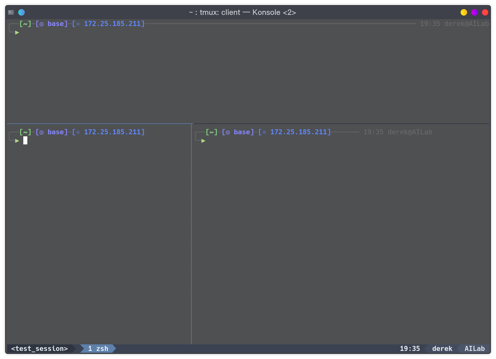

# \<dot\>Dotfiles
This repo contains (nearly) all of the dot files which I need to configure my coding environment. To quickly reconstruct the environments and deploy these dot files, scripts are also included in this repo. 

## Contents
### **Tmux**

+ OK on
  + [x] Ubuntu, Archlinux
+ NOT TESTED on
  + [ ] MacOS

This part is inspired by [Johnny4Fun](https://github.com/Johnny4Fun/.tmux).
